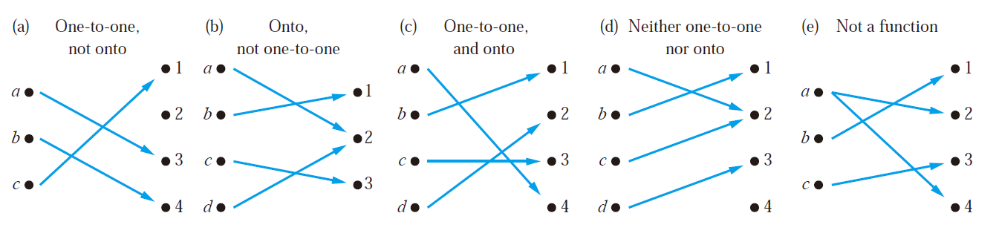

 Chaptcer 02 Basic Structures 基本结构

Part 02 Function and Sequence

Covering 2.3~2.4

------

# Functions 函数

## Definitions 定义

Let A and B be **nonempty** sets. A **function** f from A to B is an assignment of **exactly one** element of B to **each element** of A.

We write f (a) = b if b is the unique element of B assigned by the function f to the element a of A.

If f is a function from A to B, we write f : A → B.

> A → B is a subset of A × B

> Functions are sometimes also called **mappings**（**映射**） or **transformations**（**变换**）

$$f:A\to B$$

$$\forall a(a\in A\to\exists!b(b\in B\wedge f(a)=b))$$

- A : **domain**（**定义域**）

- B : **codomain**（**陪域**）

- b : **image**（**像**）
- a : **preimage**（**原像**）

The **range**（**值域**）, or image, of f is the set of all images of elements of A.

If f is a function from A to B, we say that f **maps**（**映射**） A to B.

> **Two Notations**:
>
> $$(f_1+f_2)(x)=f_1(x)+f_2(x)$$
>
> $$(f_1f_2)(x)=f_1(x)f_2(x)$$

Let f be a function from A to B and let S be a subset of A. The image of S under the function f is the subset of B that consists of the images of the elements of S. We denote the image of S by f (S), so

$$f(S)=\{f(s)|s\in S\}$$

> $$f(S\cup T)=f(S)\cup f(T)$$
>
> $$f(S\cap T)\subseteq f(S)\cap f(T)$$
>
> **Explaination**:
>
> For the first equivalent, just prove $$f(S+T)\subseteq f(S)+f(T)$$ and $$f(S)+f(T)\subseteq f(S+T)$$ using the method proof by cases
>
> For the second one, itself is easy to prove, but the interesting part is how to give a counterexample to prove that $$f(S)\cap f(T)\subseteq f(S\cap T)$$ is wrong.
>
> This counterexample is that when f() is not one-to-one (this will be mentioned right below), the latter one can be larger than the previous one! (Specific example omitted)

The **graph**（图） of the function f is the set of ordered pairs

$$\{(a,b)|a∈A\wedge f(a)=b\}$$

A **monotonic**（**单调**） function f is either **monotonically (strictly) increasing** ($$\forall x\forall y(x<y\to f(x)<f(y))$$) or **monotonically (strictly) decreasing** (($$\forall x\forall y(x<y\to f(x)>f(y))$$))

## Correspondences 对应关系

### One-to-One Function 一对一函数

A function f is **one-to-one**（**一对一**） (denoted 1-1), or **injective**（**单射函数**）if

$$\forall a\forall b(f(a)=f(b)\to a=b)$$

### Onto Functions 映上函数

A function f from A to B is called **onto**（**映上**）, or **surjective**（**满射**） if

$$\forall b\in B\exists a\in A(f(a)=b)$$

> In short, **every b in B has a preimage**.

### One-to-one Correspondence Functions 一一对应函数

The function f is a **one-to-one correspondence**（**一一对应**）, or a **bijection**（**双射**）, if it is **both** one-to-one and onto

> Whenever there is a bijection from A to B, the two sets must have **the same number of elements** or **the same cardinality**.

### Examples of Different Types of Correspondences

> Suppose that f : A → B
>
> - To show that f is injective, show that if f (x) = f (y) for arbitrary x, y ∈ A, x = y.
> - To show that f is not injective, find particular elements x, y ∈ A such that x ≠ y and f (x) = f (y).
> - To show that f is surjective, consider an arbitrary element y ∈ B and find an element x ∈ A such that f (x) = y.
> - To show that f is not surjective Find a particular y ∈ B such that f (x) ≠ y for all x ∈ A.

## Special Functions 特殊函数

### Inverse Functions 反函数

Let f be a one-to-one correspondence from the set A to the set B, the **inverse function of f** is denoted by $$f^{-1}$$

$$f^{-1}(y)=x$$ iff $$f(x)=y$$

> No inverse function exists unless f is a bijection
>
> Function f is **invertible**（**可逆的**）  iff  f is bijective

### **Compositions of Functions** 复合函数

$$f\circ g(a)=f(g(a))$$

> $f\circ g$ can’t be defined unless the range of g is a subset of the domain of f.

## Two Important Functions 两大重要函数

### The floor function 取底函数

The floor function f (x) is the largest integer less than or equal to the real number x

$$\lfloor x\rfloor$$

> The floor function is often also called the greatest integer function. It is often denoted by [x]

### The ceiling function 取顶函数

$$\lceil x\rceil$$

# Sequence 序列

A **sequence** is a function from a subset of the set of intergers (usually either the set {0,1,2,…} or the set {1,2,3,…}) to a set S. We use the notation **$$a_n$$** to denote the image of the image of the integer **n**. We call $$a_n$$ a term of the sequence $$\{a_n\}$$.

> **The order in a sequence matters!**

## Some Sequences 一些序列

### Geometric Progression 几何级数

$$a,ar,ar^2,ar^3,...,ar^n,...$$

### Arithmetic Progression 算术级数

$$a,a+d,a+2d,...,a+nd,...$$

### Recurrence 递推

e.g. Fibonacci Sequence

## Summations 求和

$$
\begin{equation*}
\sum_{i=m}^na_i=\sum\nolimits_{i=m}^na_i=\sum\nolimits_{m≤i≤n}a_i=a_m+a_{m+1}+...+a_n
\end{equation*}
$$

$$
\sum_{s∈S}f(s)
$$

### Some Useful Summation Formulae 求和公式

$$
\sum_{k=1}^nk^2=\frac{n(n+1)(2n+1)}{6}
$$

$$
\sum_{k=1}^nk^3=\frac{n^2(n+1)^2}{4}
$$

$$
\sum_{k=1}^{\infin}kx^{k-1}=\frac{1}{(1-x)^2},|x|<1
$$

