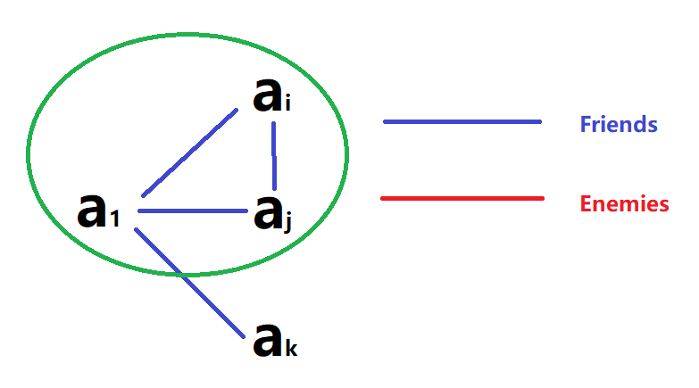
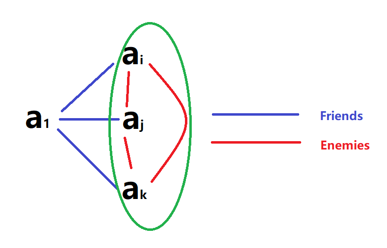
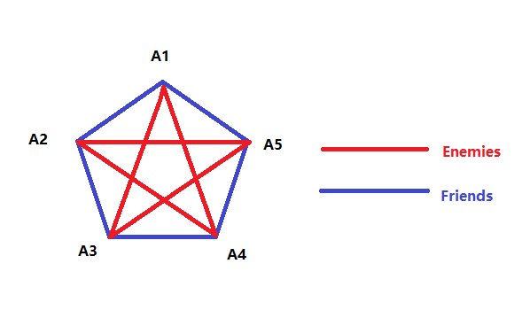

 Chaptcer 06 Counting 计数

Part 02 The Pigeonhole Principle 抽屉原理

covering 6.2

---

# The Pigeonhole Principle 抽屉原理

**If k is a positive integer and k+1 or more objects are placed into k boxes, then there is at least one box containing two or more of the objects.** 

It is also called ***Dirichlet Drawer Principle*** （迪利克雷抽屉原理）

> 其实pigeonhole principle应该被翻译为**鸽洞原理**，但是我中文说抽屉原理已经习惯了……

普通的例题真的不想放了，没营养，应用基本抽屉原理的只有一道值得看看——

## e.g.1 Party!

In a party of 2 or more people, there are 2 people with the same number of friends in the party. (Assuming you can’t be your own friend and that friendship is mutual.)

> Pigeons :  the *n* people (with *n* > 1).
>
> Pigeonholes: the possible number of a person’s friends, {0, 1, 2, 3, …, *n*-1}

貌似抽屉原理不能用了……

Really? 当然不是

奥秘就在于抽屉里，0 和 n-1 不能同时取到——假如某个人一个朋友都没有，那么就不可能有人有 n-1 个朋友，反之亦然……

## Corollary 一个推论

A function f from a set with k+1 or more  elements to a set with k elements is not one-to-one.

# **The Generalized Pigeonhole Principle** 广义鸽巢原理

If N objects are placed into k boxes, then there is at least one box containing at least $$\lceil\frac{N}{k}\rceil$$ objects

> **Easy example**:
>
> A bowl contains 10 red balls and 10 blue balls. One selects balls at random without looking at them. How many balls must be selected to be sure of having at least three balls of the same color?
>
> 超简单的一题，但是要是想用这个定理来说明的话，就是寻找一个最小的N，使得$$\lceil\frac{N}{2}\rceil=3$$
>
> $$\therefore N=5$$

## Phrased in terms of functions 函数表示

$$f : A \rightarrow B$$, if $$\left\lceil\frac{|A|}{|B|}\right\rceil= i$$, then there must exist elements $$a_{1}, a_{2}, \cdots, a_{i} \in A$$ such that $$f\left(a_{1}\right)=f\left(a_{2}\right)=\cdots=f\left(a_{i}\right)=b \in B$$

# Some elegant applications of the pigeonhole principle 抽屉原理的简洁应用（优雅应用）

> 中文译本将这一节翻译为“简单应用”，不敢恭维

## e.g.2 Divisible

Show that among any n+1positive integers not exceeding 2*n* there must be an integer that divides one of the other integers. 

> Let n+1 positive integers be $$a_{1}, a_{2}, \cdots, a_{n+1}\left(1 \leq a_{i} \leq 2 n\right)$$
>
> Write $$a_{\mathrm{i}}(i=1,2, \ldots, n+1)$$ as $$2^{k_{i}} q_{p}$$, where $$k_i$$ is a nonnegative integer and $$q_i$$ is an odd positive number less than $$2n$$
>
> Since there are only n odd positive integers less than 2n, by the pigeonhole principle it follows that there exist integers i and j such that $$q_i=q_j=q$$
>
> then $$a_{i}=2^{k_{i}}q$$ and $$a_{j}=2^{k_{k}}q$$
>
> It follows that if $$a_i<a_j$$, then $$a_i|a_j$$, while if $$a_j<a_i$$, then $$a_j|a_i$$

## e.g.3 Ball Game

During 11 weeks football games will be held at least 1 game a day, but at most 12 games be arranged each week. Show that there must be a period of some number of consecutive days during which exactly 21 games must be played. 

> $$x_i$$: the number of football games held on the $$i^{th}$$ day
>
> $$a_{i}=\sum_{k=1}^{i} x_{k} \quad 1 \leq a_{1}<a_{2} \ldots<a_{77} \leq 12 \times 11=132$$
>
> $$c_{i}=a_{i}+21 \quad 22 \leq c_{1}<c_{2}<\ldots<c_{77} \leq 132+21=153$$
>
> $$A=\left\{a_{1}, a_{2}, \ldots a_{77}, c_{1}, c_{2}, \ldots c_{77}\right\} \quad B=\{1,2, \ldots, 153\}$$
>
> $$\exists i \neq j$$ such that $$a_i=c_j$$
>
> $$a_{i}=a_{j}+21$$
>
> $$a_{i}-a_{j}=x_{i}+x_{i-1}+\ldots+x_{j+1}=21$$

### Deeper Thinking 深入思考

#### 1. Show that there must be a period of some number of consecutive days during which exactly 22 games must be played

简单起见，只写出不一样的部分

$$c_{i}=a_{i}+22 \quad 23 \leq c_{1}<c_{2}<\ldots<c_{77} \leq 132+22=154$$

$$A=\left\{a_{1}, a_{2}, \ldots a_{77}, c_{1}, c_{2}, \ldots c_{77}\right\} \quad B=\{1,2, \ldots, 154\}$$

此时有154个物品和154个抽屉，貌似抽屉原理又不能用了……

其实只需分类讨论一下就好

1. 如果刚好一一对应，那么一定有一个$$a_i=21$$（不可能是$$c_i$$，因为$$c_i\geq23$$），OK
2. 如果没有一一对应，则$$\exists i \neq j$$ such that $$a_i=c_j$$，余下跟上一题相同

Q.E.D

#### 2. Is it still possible to show that there must be a period of some number of consecutive days during which exactly 23 games must be played

In $$a_1\sim a_{24}$$, we must have $$a_i\equiv a_j(mod\ 23)$$

> 1. If $$a_i-a_j=23$$, proof finish
>
> 2. Else if we have  $$a_i-a_j=46$$, which means $$a_{24}\geq a_i\geq47$$
>
> > Then in $$a_{24}\sim a_{47}$$, we must have $$a_i\equiv a_j(mod\ 23)$$
> >
> > > 2.1 If $$a_i-a_j=23$$, proof finish
> > >
> > > 2.2 Else if we have  $$a_i-a_j=46$$, which means $$a_{47}\geq a_i\geq93$$
> > >
> > > > Then in $$a_{47}\sim a_{70}$$, we must have $$a_i\equiv a_j(mod\ 23)$$
> > > >
> > > > 2.2.1 If $$a_i-a_j=23$$, proof finish
> > > >
> > > > 2.2.2 Else if we have  $$a_i-a_j=46$$, which means $$a_{70}\geq a_i\geq139$$
> > > >
> > > > ​          However, since $$a_i\leq 132$$, there is a contradiction, so it must be the other situations
> > >
> > > 2.3 Else if we have  $$a_i-a_j=69$$, which means $$a_{47}\geq a_i\geq116$$
> > >
> > > ​       However, since $$a_{47}\leq 102$$, there is a contradiction, so it must be the other situations
>
> 3. Else if we have  $$a_i-a_j=69$$, which means $$a_{24}\geq a_i\geq70$$
>
> > Then in $$a_{24}\sim a_{47}$$, we must have $$a_i\equiv a_j(mod\ 23)$$
> >
> > > 3.1 If $$a_i-a_j=23$$, proof finish
> > >
> > > 3.2 Else if we have  $$a_i-a_j=46$$, which means $$a_{47}\geq a_i\geq116$$
> > >
> > > ​       However, since $$a_{47}\leq 102$$, there is a contradiction, so it must be the other situations
>
> 4. Else if we have  $$a_i-a_j=92$$, which means $$a_{24}\geq a_i\geq93$$
>
> ​        However, since $$a_{24}\leq 79$$, there is a contradiction, so it must be the other situations

整个证明思路，简而言之，就是树形结构一般层层深入

对于每一条分支，要么它导向了正确的结果，要么它本身并不存在（即产生了矛盾）

（有点递归的味道）

## e.g.3 Sum

Suppose that there are *n* arbitrary integers $$x_{1}, x_{2}, \ldots, x_{n}$$. Show that there exist some consecutive integers such that the sum of these integers is the multiple of *n*.

> $$a_{i}=\sum_{k=1}^{i} x_{k}(i=1,2, \ldots, n)$$
>
> Then the remainders of $$a_i$$ divided by n is in the set $$\{0,1,…,n-1\}$$, and the cardinality of this set is n
>
> 1. $$\exists i\left(n | a_{i}\right)$$
>
>    Finished
>
> 2. $$\neg\exists i\left(n | a_{i}\right)$$
>
>    0 will be impossible, so the cardinality of the set is n-1, then we can use the pigeonhole principle

## e.g.4 Subsequence 

Every sequence of $$n^2+1$$ distinct integers contains a subsequence of length *n* + 1 that is either strictly increasing or strictly decreasing. 

> **Explanation**:
>
> For example,   n=2
>
> 4,8,3,6,1
>
> 4->3->1

> Let the sequence be $$a_{1}, a_{2}, \ldots, a_{n^{2}+1}$$
>
> Associate $$\left(x_{k}, y_{k}\right)$$ to the term $$a_k$$, where $$x_k$$ is the length of the longest increasing subsequence starting at $$a_k$$, and $$y_k$$ is the length of the longest decreasing subsequence starting at $$a_k$$
>
> Suppose that there is no increasing or decreasing subsequence of length n+1.Then $$1 \leq x_{k} \leq n \quad 1 \leq y_{k} \leq n$$
>
> Hence, there are $$n \times n=n^{2}$$ pairs $$\left(x_{k}, y_{k}\right)$$
>
> Since there are $$n^{2}+1$$ $$a_{k}$$, by the pigeonhole principle, it follows that there exist terms $$a_{i}, a_{j}\left(1 \leq i<j \leq n^{2}+1\right)$$ such that $$\left(x_{i}, y_{i}\right)=\left(x_{j}, j_{j}\right)$$
>
> But $$a_i\neq a_j$$, so there must be a contradiction
>
> Q.E.D.

## e.g.5 Ramsey Number

The Ramsey number R(m,n), where m and n are positive integers greater than or equal to 2, denotes the minimum number of people at a party so that there are either m mutual friends or n mutual enemies, assuming that every pair of people at the party are friends or enemies.

Assume that in a group of six people, each pair of individuals consists of two friends or two enemies. Show that there are either three mutual friends or three mutual enemies in the group

> Let the six people be $$a_{1}, a_{2}, a_{3}, a_{4}, a_{5}, a_{6}$$
>
> Take $$a_1$$ into consideration. Of the five other people in the group, there are either three or more who are friends of *a*1, or three or more who are enemies of $$a_1$$. This follows from the generalized pigeonhole principle. 
>
> 1. Suppose that $$a_i,a_j,a_k$$ are friends of $$a_1$$
>
>    then if any two of them are friends, we have three mutual friends
>
>    
>
>    else if three of them are all enemies, we have three mutual enemies
>
>    
>
> 2. Suppose that $$a_i,a_j,a_k$$ are enemies of $$a_1$$
>
>    almost the same as situation 1

Through this problem, we see that $$R(3,3)\leq 6$$

In addition, we also have that $$R(3,3)>5$$ due to a counterexample given below

> **Counterexample**:
>
> In this counterexample, there are no mutual friends or enemies
>
> 

So, we have $$R(3,3)=6$$

## Summary 小总结

### 1. 构造合适的物品、抽屉是解题关键

这些题目中，每题的构造方式都独具特色

### 2. [特殊题型] 物品、抽屉数量一样

> 例如 e.g.2 的拓展 1，以及 e.g.3

对于这些题目，解决的关键之道在于两点：

1. 抽屉其实没那么多，例如 e.g.1 中稍加分析就会发现0和 n-1 无法同时取到
2. 分类讨论
   1. 如果每个抽屉里都有东西，那么其实可能已经满足要求了
   2. 如果有抽屉为空，就一定有抽屉中东西数量比1多，证毕
3. 还有一种思路，就是补一个 0 作为物体，使得物体数量再次比抽屉数量多

### 3. [特殊题型] 物品数量少于抽屉数量

> 例如 e.g.2 的拓展 2
>
> 对于此题，我们利用的是“小抽屉”，即自行将24个原抽屉组合为新的一组，**将讨论范围缩小至物品数量多于抽屉数量**，进而得以运用抽屉原理

